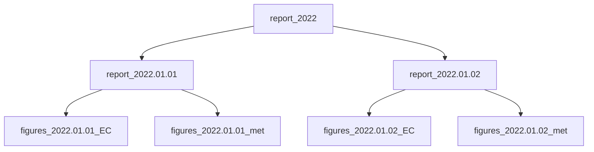

# checkETC
checkETC is a tool for testing biomet and eddy covariance data files. The compatiblity of the file with ETC requirements is tested as well as unrealitic values, gaps, NaNs...

The 3 main functions are:
- ```QC(Site, DateCheck = None)```: perform tests on 1 specific day. A html file (Report.html) is produced. A csv file (Flags.csv) is also produced, with one alert flag per file type. Finally for each data file, a html file containg plots is produced (the plot files generation can be diables in the ini file). All the files are generated at the location specified in the config file (see below).
- ```QC_n(Site, DateStart, DateEnd)```: perform a test for each day included between the 2 specified dates
- ```ListReports(Site, Years=None)```: build a yearly html report.

The 3 levels of reports: level 1: yearly / level 2: daily, level 3: per data file



## Command line
It is possible to call the script with arguments.
  ```txt
  usage: checkETC [-h] [-d [DateStart]] [-e [DateEnd]] [-y [YearsReport]] [Site]

Check ETC files. Examples: "checkETC GL-ZaF -d now -y now" or "checkETC GL-ZaF
-d 2022-01-01 -e 2022-01-31 -y 2022"

positional arguments:
  Site              name of the site to check must match the section name in
                    the ini file (for ex. "GL-ZaF").

optional arguments:
  -h, --help        show this help message and exit
  -d [DateStart]    Date of the 1st day to check, format yyyy-mm-dd or "now".
                    If not provided no data file is checked.
  -e [DateEnd]      Date of the last day to check format yyyy-mm-dd or "now".
                    If not provided only the data of DateStart is checked.
  -y [YearsReport]  years used to produce yearly reports, comma-serparated-
                    list of years or "now". If not provided, no yearly report
                    is produced.
  ```
    
## Required files:
- an ini file (checkETC.ini) containg general information for each site:
  ```ini
  [GL-ZaF]
  FolderHTMLReport=O:\Tech_ICOS\DATA\GL-ZaF\3.processed\reports\<YYYY>\<MM>.<DD>
  FileConfig=O:\Tech_ICOS\scripts\python\checkETC\checkETC_ZaF.csv
  CreateFigures=TRUE
  ```
  Where:
  - FolderHTMLReport: path of the folder where html reports are generated. If \<YYYY\>, \<MM\>, \<DD\> strings are used, the date of the file being tested is used to build the path
  - FileConfig: path of a csv file listing information for each data file type
  - CreateFigures: bool, to generate or not the plots

- a html template file for the report: ReportEmpty.html
- a config file (csv), with information per data file type (Warning: editing csv files in excel mess up the double quotes)

| Group | Process | Folder | FileMask | FileHeader | Period | NumberFiles | ActiveFrom | ActiveTo | FILE_ID | FILE_LOGGER_ID | FILE_TYPE | FILE_HEAD_NUM | FILE_HEAD_VARS | FILE_EXTENSION | FILE_MISSING_VALUE | FILE_TIMESTAMP | FILE_COMPRESS |
| ------------- | ------------- | ------------- | ------------- | ------------- | ------------- | ------------- | ------------- | ------------- | ------------- | ------------- | ------------- | ------------- | ------------- | ------------- | ------------- | ------------- | ------------- |
| Met2 | TRUE | O:\Tech_ICOS\DATA\GL-ZaF\4.delivered\met\<YYYY> | GL-ZaF_BM_<YYYY><MM><DD>_L04_F02.dat | O:\Tech_ICOS\scripts\python\checkETC\headersCriteria\met\GL-ZaF_BMHEADER_202204261956_L04_F02.csv | 20 | 1 | 20220426 |  | 2 | 4 | BM | 0 | 0 | .dat | "NaN" | Quotes |  |
| EC | TRUE | O:\Tech_ICOS\DATA\GL-ZaF\4.delivered\EC\<YYYY> | GL-ZaF_EC_????????????_L01_F01.zip | O:\Tech_ICOS\scripts\python\checkETC\headersCriteria\EC\GL-ZaF_ECHEADER_202107071330_L01_F01.csv | 0.1 | 48 | 20210707 |  | 1 | 1 | EC | 1 | 1 | .csv | -9999 | No quotes | .zip |
    
- for each data type, a header file (csv), listing the column names and some criterias


| Variable | TIMESTAMP | D_SNOW_1_1_1 |
| ------------- | ------------- | ------------- |
| Min | NaN | -0.5 |
| Max | NaN | -2 |
| Process | 0 | 1 |
| Plot | 0 | 1 |

## todo:
- [ ] zip text report and email it
