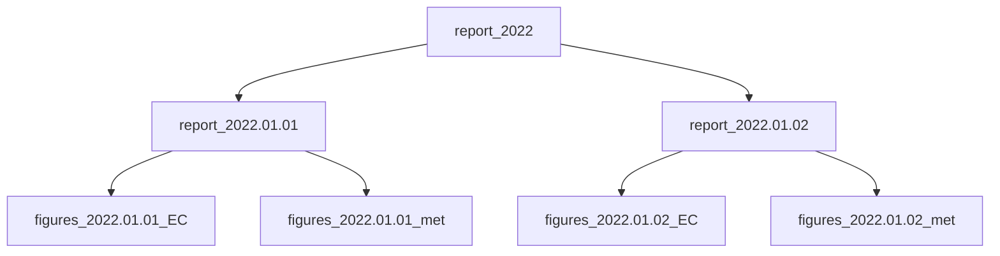

# checkETC
checkETC is a python script for testing biomet and eddy covariance data files. The compatiblity of the file with ETC requirements is tested as well as unrealitic values, gaps, NaNs...

Required libraries: pandas, plotly

The 3 main functions are:
- ```py QC(Site, DateCheck = None)```: perform tests on 1 specific day. A html file (Report.html) is produced for that day. A csv file (Flags.csv) is also produced, with a single flag per file type. Optionally, for each data file a html file containg plots is produced. All the files are generated in a directory named after the date of the processed day, at the location specified in the config file (see below).
- ```QC_n(Site, DateStart, DateEnd)```: perform a test for all days within the specified range, including DateStart and DateEnd.
- ```ListReports(Site, Years=None)```: build a yearly html report, listing flags previously saved in the daily csv files.

The 3 levels of reports: level 1: yearly / level 2: daily, level 3: daily and per file type



## Command line
It is possible to call the script with arguments.
  ```txt
usage: checkETC [-h] [-d [DateStart]] [-e [DateEnd]] [-y [YearsReport]] [Site]

Check ETC files. Examples: "checkETC GL-ZaF -d yesterday -y yesterday" or "checkETC GL-ZaF -d 2022-01-01 -e 2022-01-31
-y 2022"

positional arguments:
  Site              name of the site to check must match the section name in the ini file (for ex. "GL-ZaF").

optional arguments:
  -h, --help        show this help message and exit
  -d [DateStart]    Date of the 1st day to check, format yyyy-mm-dd or "yesterday" or "today". If not provided no data
                    file is checked.
  -e [DateEnd]      Date of the last day to check format yyyy-mm-dd or "yesterday" or "today". If not provided only
                    the data of DateStart is checked.
  -y [YearsReport]  years used to produce yearly reports, comma-serparated-list of years or "yesterday" or "today". If
                    not provided, no yearly report is produced.
  ```
  
Here is example batch file, activating Anaconda, that can be run daily, for example with the Windows Task Scheduler: 
```bat
call C:\ProgramData\Anaconda3\condabin\conda activate
python D:\checkETC.py GL-ZaF -d yesterday -y yesterday
```
    
## Required files:
- an ini file (```checkETC.ini```) containg general information for each site:
  ```ini
  [GL-ZaF]
  FolderHTMLReport=D:\DATA\reports\<YYYY>\<MM>.<DD>
  FileConfig=D:\checkETC_ZaF.csv
  CreateFigures=True
  Zip=False
  ```
  Where:
  - ```["Site"]```: The section name is a unique string refering to the site. This name is the ```Site``` argument for processing functions.
  - ```FolderHTMLReport```: path of the folder where html reports are generated. Strings ```<YYYY>```, ```<MM>```, ```<DD>``` are replaced by the year, month and day of the date of the file being tested. ```?``` is a jocker character.
  - ```FileConfig```: path of a csv file containing information for each data file type.
  - ```CreateFigures```: bool, to generate or not the plots (mostly for speeding up processing during tests).
  - ```Zip```: bool, to zip the daily html report file.

- a html template file for the report: ```ReportTemplate.html```. It can be customized as long as the strings ```***Add title here***``` and ```***Add body here***``` are present.
- a config file (csv), with information per data file type (warning: editing a csv files in excel mess up the double quotes):
  - ```Type```: Unique string refering to the data type name (met, soil, EC...)
  - ```Process```: Boolean defining is the ```Group``` should be processed
  - ```Folder```: data files location. Strings ```<YYYY>```, ```<MM>```, ```<DD>``` are replaced by the year, month and day of the date of the file being tested. ```?``` is a jocker character.
  - ```FileMask```: data files mask. Strings ```<YYYY>```, ```<MM>```, ```<DD>``` are replaced by the year, month and day of the date of the file being tested. ```?``` is a jocker character.
  - other columns: aggregatied information retrieved from the BADM database.

| Type | Process | Folder | FileMask | FileHeader | Period | NumberFiles | ActiveFrom | ActiveTo | FILE_ID | FILE_LOGGER_ID | FILE_TYPE | FILE_HEAD_NUM | FILE_HEAD_VARS | FILE_EXTENSION | FILE_MISSING_VALUE | FILE_TIMESTAMP | FILE_COMPRESS |
| ------------- | ------------- | ------------- | ------------- | ------------- | ------------- | ------------- | ------------- | ------------- | ------------- | ------------- | ------------- | ------------- | ------------- | ------------- | ------------- | ------------- | ------------- |
| Met | TRUE | D:\DATA\met\<YYYY> | GL-ZaF_BM_<YYYY><MM><DD>_L04_F02.dat | D:\headersCriteria\met\GL-ZaF_BMHEADER_202204261956_L04_F02.csv | 20 | 1 | 20220426 |  | 2 | 4 | BM | 0 | 0 | .dat | "NaN" | Quotes |  |
| EC | TRUE | D:\DATA\\EC\<YYYY> | GL-ZaF_EC_????????????_L01_F01.zip | D:\headersCriteria\EC\GL-ZaF_ECHEADER_202107071330_L01_F01.csv | 0.1 | 48 | 20210707 |  | 1 | 1 | EC | 1 | 1 | .csv | -9999 | No quotes | .zip |

- for each data type, a header file (csv), listing the column names and some criterias:
  - ```Process``` determines if the variable is tested for numeric values, NaNs and out of range values. 1=tested, 0=not tested.
  - ```Min``` and ```Max```: thresholds used to test if values are out of range. If set to NaN, the test is not performed.
  - ```Group``` is a free string field used to group multiple variables in the same figure. If ```Group``` is NaN, the variable is not plotted.

| Variable | Process | Min | Max | Group |
| ------------- | ------------- | ------------- | ------------- | ------------- |
| TIMESTAMP | 0 | NaN | NaN | NaN |
| G_1_1_1 | 1 | -50 | 200 | G |
| G_2_1_1 | 1 | -50 | 200 | G |
| WTD_1_1_1 | 1 | -0.2 | 0.2 | WTD |

## QC tests
- Importation: Check that the file was imported without error due to wrong format
- Missing: Check if there are any missing value
- Header: If there is a header, check that the variable names match variables specified in the config file (csv)
- NbColumns: Check the number of data columns
- Dates: Check if the timestamp of the last record match with the date contained in the file name
- NbRecords: Check that we get the expected number of records, based on the sampling frequency specified in the config file (csv)
- Gaps: Check for data gaps
- Num: Check that values are numeric
- nan: Check that values are non NaNs
- Range: Check that values fall within the expected range
- DiagnosticByte: Specific test for li-7200 diagnostic byte, see description.html or Licor manual
- TimeEC: EC specific, check milliseconds of timestamps are multiple of 100ms

## Website
The html file ```website/index.html``` redirects to the annual report of the present year.
